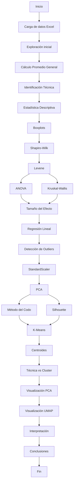

# WORKFLOWS DEL PROYECTO

Este documento describe los bloques de trabajo necesarios para clonar, configurar, ejecutar, analizar y actualizar el proyecto.

---

# BLOQUE 1. OBTENCIÓN DEL PROYECTO

## Objetivo

Descargar una copia local del repositorio y abrirla en Visual Studio Code.

## Requisitos

- Git instalado.
- Visual Studio Code instalado.
- Python 3.14.5 instalado.

## Procedimiento

### Clonar el repositorio

```bash
git clone URL_DEL_REPOSITORIO
```

### Ingresar a la carpeta del proyecto

```bash
cd "Trabajo final fundamentos ciencias de datos"
```

### Abrir el proyecto en Visual Studio Code

```bash
code .
```

## Resultado esperado

El proyecto queda disponible localmente para su desarrollo y ejecución.

---

# BLOQUE 2. CONFIGURACIÓN DEL ENTORNO

## Objetivo

Preparar el entorno de trabajo e instalar las dependencias necesarias.

## Procedimiento

### Seleccionar el intérprete de Python

En Visual Studio Code:

1. Presionar Ctrl + Shift + P.
2. Seleccionar **Python: Select Interpreter**.
3. Elegir el intérprete correspondiente a Python 3.14.5.

### Instalar dependencias

```bash
python -m pip install -r requirements.txt
```

### Verificar instalación

```bash
python -m pip list
```

## Resultado esperado

El entorno queda configurado correctamente para ejecutar el proyecto.

---

# BLOQUE 3. CARGA Y PREPARACIÓN DE LOS DATOS

## Objetivo

Preparar el conjunto de datos para los análisis estadísticos y de Ciencia de Datos.

## Procedimiento

### Lectura de datos

```python
pd.read_excel("Notas 10.xlsx")
```

### Exploración inicial

- Verificación de dimensiones.
- Inspección de columnas.
- Revisión de tipos de datos.

### Construcción de variables

#### Promedio académico general

Se calcula el promedio de las asignaturas académicas para cada estudiante.

#### Identificación de la técnica

La especialidad técnica se obtiene a partir de las variables codificadas mediante One-Hot Encoding.

## Resultado esperado

Obtención de una base de datos lista para análisis descriptivos, inferenciales y predictivos.

---

# BLOQUE 4. ANÁLISIS ESTADÍSTICO

## Objetivo

Describir y comparar el rendimiento académico entre especialidades técnicas.

## Estadística descriptiva

### Actividades

- Conteo de estudiantes por técnica.
- Media.
- Mediana.
- Desviación estándar.
- Valores mínimos.
- Valores máximos.

### Visualización

```python
sns.boxplot()
```

Permite observar:

- Distribución de los promedios.
- Dispersión de los datos.
- Posibles valores atípicos.

## Resultado esperado

Descripción general del comportamiento académico por especialidad técnica.

---

# BLOQUE 5. ANÁLISIS INFERENCIAL

## Objetivo

Evaluar si existen diferencias significativas entre especialidades técnicas.

## Verificación de supuestos

### Shapiro-Wilk

```python
shapiro()
```

Evalúa normalidad dentro de cada grupo.

### Levene

```python
levene()
```

Evalúa homogeneidad de varianzas.

## Comparación entre grupos

### ANOVA

```python
f_oneway()
```

Compara medias entre técnicas.

### Kruskal-Wallis

```python
kruskal()
```

Alternativa no paramétrica cuando los supuestos de ANOVA no se cumplen.

## Tamaño del efecto

Se calcula:

```math
\eta_H^2
```

para cuantificar la magnitud de la relación entre técnica y rendimiento académico.

## Resultado esperado

Determinación de la existencia o ausencia de diferencias significativas entre especialidades.

---

# BLOQUE 6. REGRESIÓN LINEAL

## Objetivo

Evaluar la capacidad explicativa de la especialidad técnica sobre el rendimiento académico.

## Procedimiento

### Variables predictoras

Especialidades técnicas codificadas mediante One-Hot Encoding.

### Variable respuesta

```python
Promedio_General
```

### Modelo

```python
LinearRegression()
```

## Métricas analizadas

- Coeficientes.
- Intercepto.
- R².

## Resultado esperado

Cuantificar cuánto del rendimiento académico puede explicarse mediante la especialidad técnica.

---

# BLOQUE 7. DETECCIÓN Y ELIMINACIÓN DE OUTLIERS

## Objetivo

Identificar observaciones atípicas que puedan afectar la calidad de la clusterización.

## Procedimiento

### Método IQR

Se calcula:

```python
Q1
Q3
IQR = Q3 - Q1
```

Posteriormente:

```python
Limite_Inferior = Q1 - 1.5 * IQR
Limite_Superior = Q3 + 1.5 * IQR
```

Los registros fuera de estos límites son considerados valores atípicos.

## Objetivos

- Mejorar estabilidad de K-Means.
- Evitar clusters artificiales.
- Obtener grupos más representativos.

## Resultado esperado

Conjunto de datos depurado para aprendizaje no supervisado.

---

# BLOQUE 8. REDUCCIÓN DE DIMENSIONALIDAD

## Objetivo

Reducir el número de variables preservando la mayor cantidad posible de información.

## Estandarización

```python
StandardScaler()
```

## PCA

```python
PCA()
```

### Objetivos

- Reducir dimensionalidad.
- Eliminar redundancia.
- Facilitar visualización.
- Optimizar clusterización.

### Resultados obtenidos

```text
Componentes PCA: 9
Varianza explicada: 93.12%
```

## Resultado esperado

Representación compacta del conjunto de datos manteniendo la estructura académica original.

---

# BLOQUE 9. CLUSTERIZACIÓN

## Objetivo

Identificar grupos de estudiantes con perfiles académicos similares.

## Selección de K

### Método del Codo

Permite analizar la disminución de la inercia para diferentes valores de K.

### Coeficiente Silhouette

```python
silhouette_score()
```

Evalúa:

- Cohesión.
- Separación.
- Calidad de agrupamiento.

### Resultados

```text
K=2 -> 0.2321
K=3 -> 0.2373
K=4 -> 0.1935
K=5 -> 0.1980
K=6 -> 0.1553
K=7 -> 0.1404
K=8 -> 0.1480
K=9 -> 0.1346
K=10 -> 0.1305
```

### Modelo final

```python
KMeans()
```

## Análisis realizados

- Tamaño de clusters.
- Centroides.
- Tabla Técnica vs Cluster.
- Comparación de promedios.

## Resultado esperado

Obtención de perfiles académicos diferenciados dentro de la población estudiantil.

---

# BLOQUE 10. VISUALIZACIÓN DE CLUSTERS

## PCA 2D

```python
PCA(n_components=2)
```

Permite visualizar:

- Separación de grupos.
- Solapamientos.
- Posibles outliers.

## UMAP

```python
UMAP()
```

Permite:

- Detectar estructuras complejas.
- Preservar relaciones locales.
- Complementar la interpretación visual.

## Resultado esperado

Comprensión visual de la estructura interna de los datos.

---

# BLOQUE 11. INTERPRETACIÓN DE RESULTADOS

## Objetivo

Analizar e interpretar los resultados obtenidos.

### Estadística descriptiva

- Comparar distribuciones.
- Identificar diferencias aparentes.

### Inferencia estadística

- Interpretar ANOVA.
- Interpretar Kruskal-Wallis.
- Interpretar η²H.

### Regresión lineal

- Analizar coeficientes.
- Interpretar R².

### Clusterización

- Analizar centroides.
- Interpretar perfiles académicos.
- Relacionar técnicas con clusters.

## Resultado esperado

Obtención de conclusiones sustentadas estadística y computacionalmente.

---

# BLOQUE 12. DIAGRAMA DE FLUJO DEL PROYECTO

## Flujo General



## Resultado esperado

Representación visual completa del flujo de trabajo implementado en el proyecto.

---

# BLOQUE 13. ACTUALIZACIÓN DEL PROYECTO

## Objetivo

Mantener el proyecto actualizado.

### Actualizar dependencias

```bash
python -m pip install --upgrade -r requirements.txt
```

### Guardar cambios

```bash
git add .
git commit -m "Actualización del proyecto"
git push
```

## Resultado esperado

Repositorio sincronizado y documentación actualizada.
